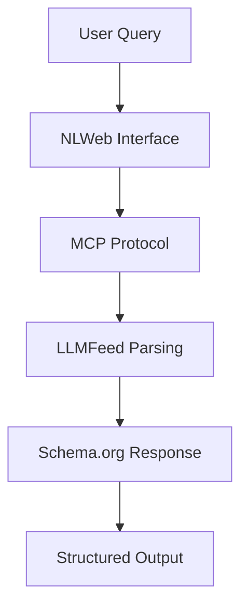

# Microsoft NLWeb and LLMFeed: Complementary Standards for the Agentic Web

**Executive Summary**: Microsoft's NLWeb and the LLMFeed specification represent complementary approaches to enabling natural language interactions on the web. Contrary to initial perceptions of competition, our technical analysis reveals that NLWeb leverages the Model Context Protocol (MCP) as its foundational transport layer, while LLMFeed provides the standardized data format. Together, they form a cohesive architecture for the emerging Agentic Web.

---

## 🔬 Introduction: Redefining Web-Agent Interaction

The emergence of Large Language Models (LLMs) and autonomous agents has exposed a fundamental limitation of the traditional web: **content designed for human consumption lacks the semantic structure and trust signals necessary for safe, intelligent agent interaction**.

Two standards have emerged to address this challenge:

- **Microsoft's NLWeb**: A comprehensive framework for adding conversational interfaces to websites
- **LLMFeed**: An open specification for structured, signed data exchange between agents

This analysis examines their technical architectures, synergies, and combined potential to revolutionize web-agent interaction.

---

## 🏗️ NLWeb: Technical Architecture Deep Dive

### Core Philosophy

NLWeb operates on the principle that **natural language should be a first-class citizen of web interfaces**, much like HTML, CSS, and JavaScript. Rather than retrofitting conversational capabilities onto existing sites, NLWeb provides native infrastructure for language-driven interaction.

### Architectural Components

#### 1. **Protocol Layer**

```python
# NLWeb Core Service Architecture
class NLWebServer:
    def __init__(self):
        self.mcp_server = MCPServer()  # MCP integration
        self.llm_connector = LLMConnector()
        self.schema_parser = SchemaOrgParser()

    async def ask(self, query: str) -> SchemaOrgResponse:
        """Core NLWeb method - natural language query processing"""
        context = await self.gather_context(query)
        response = await self.llm_connector.process(query, context)
        return self.format_schema_response(response)
```

#### 2. **Data Integration Layer**

NLWeb leverages existing web standards:

- **Schema.org markup**: Semantic content structure
- **RSS/Atom feeds**: Content syndication
- **JSON-LD**: Linked data representation
- **OpenAPI specifications**: API documentation

#### 3. **MCP Server Implementation**

Every NLWeb instance functions as a Model Context Protocol server:

```json
{
  "method": "ask",
  "params": {
    "query": "Find sustainable cooking articles from this month",
    "context": {
      "site_type": "media",
      "content_filters": ["published_date"],
      "response_format": "schema_org"
    }
  }
}
```

### Key Innovations

1. **Mixed Mode Programming**: Combining traditional programmatic logic with LLM-driven processing
2. **Technology Agnostic**: Support for multiple LLM providers (OpenAI, Anthropic, Meta, etc.)
3. **Lightweight Deployment**: Runs on everything from data centers to laptops
4. **Real-time Context**: Access to live website data without static exports

---

## 📋 LLMFeed: The Universal Agent Data Format

### Core Philosophy

LLMFeed addresses the fundamental need for **structured, verifiable, and intent-aware data exchange** in the Agentic Web. Unlike NLWeb's focus on user interfaces, LLMFeed provides the data format and trust infrastructure.

### Technical Specification

#### 1. **Mandatory Structure**

```json
{
  "feed_type": "mcp",
  "metadata": {
    "origin": "https://example.org",
    "title": "Service Definition",
    "generated_at": "2025-06-10T14:30:00Z"
  }
}
```

#### 2. **Trust & Verification Layer**

```json
{
  "trust": {
    "signed_blocks": ["feed_type", "metadata", "trust", "capabilities"],
    "scope": "public",
    "certifier": "https://llmca.org",
    "public_key_hint": "https://llmca.org/.well-known/public.pem",
    "algorithm": "ed25519"
  },
  "signature": {
    "value": "base64-encoded-signature",
    "created_at": "2025-06-10T14:30:00Z"
  }
}
```

#### 3. **Agent Behavior Guidance**

```json
{
  "agent_guidance": {
    "interaction_tone": "professional",
    "consent_hint": "Require explicit user consent for health data access",
    "risk_tolerance": "low",
    "fallback_behavior": "escalate_to_human"
  }
}
```

### Feed Type Ecosystem

| Feed Type      | Purpose            | NLWeb Integration                    |
| -------------- | ------------------ | ------------------------------------ |
| `mcp`          | Service definition | Maps to NLWeb site capabilities      |
| `export`       | Content sharing    | Structured data for NLWeb processing |
| `capabilities` | API functions      | NLWeb callable endpoints             |
| `session`      | Conversation state | NLWeb interaction history            |
| `credential`   | Access tokens      | NLWeb authentication                 |

---

## 🔄 Synergy Analysis: How They Work Together

### Correcting the Competition Narrative

Initial analysis suggested NLWeb and LLMFeed were competing standards. Technical investigation reveals the opposite: **they are complementary layers of the same infrastructure**.

```
┌─────────────────┐    ┌──────────────────┐
│   User Query    │───▶│  NLWeb Interface │
└─────────────────┘    └──────────────────┘
                              │
                              ▼
                    ┌──────────────────┐
                    │   MCP Protocol   │ ◄─── Transport Layer
                    └──────────────────┘
                              │
                              ▼
                    ┌──────────────────┐
                    │ LLMFeed Format   │ ◄─── Data Format
                    └──────────────────┘
                              │
                              ▼
                    ┌──────────────────┐
                    │  Data Sources    │
                    └──────────────────┘
```

### Technical Integration Points

#### 1. **Protocol Harmony**

```typescript
// NLWeb leverages MCP, which uses LLMFeed
interface NLWebMCPIntegration {
  transport: 'MCP';
  dataFormat: 'LLMFeed';
  capabilities: LLMFeedCapabilities[];
  trustModel: LLMFeedTrust;
}
```

#### 2. **Data Flow**



#### 3. **Trust Inheritance**

NLWeb inherits LLMFeed's cryptographic trust model:

- Signed manifests via LLMFeed trust blocks
- Certificate verification through LLMCA
- Provenance tracking across interactions

---

## 📊 Comparative Analysis

### Architectural Positioning

| Aspect                     | NLWeb                              | LLMFeed                          |
| -------------------------- | ---------------------------------- | -------------------------------- |
| **Primary Focus**          | User interface layer               | Data format & trust              |
| **Scope**                  | Website conversational interfaces  | Universal agent data exchange    |
| **Trust Model**            | Inherits from underlying protocols | Native cryptographic signatures  |
| **Governance**             | Microsoft-led, open source         | Community-driven, vendor-neutral |
| **Integration Complexity** | High (full framework)              | Low (JSON files)                 |
| **Deployment**             | Requires Python service            | Static files + optional APIs     |

### Functional Comparison

#### **NLWeb Strengths**

- **Turn-key solution**: Complete framework for conversational websites
- **Real-time processing**: Live data integration without pre-export
- **User experience**: Optimized for human-agent interaction
- **Technology flexibility**: Multiple LLM and vector database support

#### **LLMFeed Strengths**

- **Universal format**: Works across any agent platform
- **Cryptographic trust**: Built-in verification and certification
- **Lightweight**: Static files, minimal infrastructure
- **Agent-first design**: Optimized for machine interpretation

#### **Complementary Benefits**

```json
{
  "nlweb_llmfeed_synergy": {
    "data_layer": "LLMFeed provides structured, trusted data",
    "interface_layer": "NLWeb provides conversational access",
    "transport_layer": "MCP enables interoperability",
    "trust_layer": "LLMCA provides verification",
    "result": "Complete Agentic Web stack"
  }
}
```

---

## 🏢 Enterprise Implementation Strategies

### Scenario 1: Pure NLWeb Implementation

**Best for**: Media companies, e-commerce sites requiring rich conversational interfaces

```python
# Enterprise deployment example
class EnterpriseNLWeb:
    def __init__(self):
        self.nlweb_server = NLWebServer()
        self.content_sources = [
            SchemaOrgScraper(),
            DatabaseConnector(),
            APIIntegration()
        ]

    async def deploy_conversational_site(self):
        await self.nlweb_server.start()
        return ConversationalInterface()
```

### Scenario 2: LLMFeed-First Architecture

**Best for**: API providers, SaaS platforms, IoT ecosystems

```json
{
  "feed_type": "mcp",
  "metadata": {
    "title": "Enterprise API Gateway",
    "origin": "https://api.enterprise.com"
  },
  "capabilities": [
    {
      "name": "queryDatabase",
      "method": "POST",
      "path": "/api/v2/query",
      "requires_user_consent": true,
      "nlweb_compatible": true
    }
  ]
}
```

### Scenario 3: Hybrid Implementation

**Best for**: Large organizations requiring both human and agent interfaces

```typescript
class HybridAgenticPlatform {
  constructor() {
    this.nlwebInterface = new NLWebServer();
    this.llmfeedExporter = new LLMFeedGenerator();
    this.mcpRouter = new MCPRouter();
  }

  async handleRequest(request: AgentRequest) {
    if (request.type === 'conversational') {
      return this.nlwebInterface.process(request);
    } else if (request.type === 'structured') {
      return this.llmfeedExporter.generateFeed(request);
    }
  }
}
```

---

## 🛡️ Security & Trust Models

### NLWeb Security Approach

- **Input validation**: Natural language query sanitization
- **Model sandboxing**: LLM output filtering and validation
- **Access control**: User authentication and authorization
- **Rate limiting**: Protection against abuse

### LLMFeed Cryptographic Trust

- **Ed25519 signatures**: Military-grade cryptographic verification
- **Certificate chains**: Third-party attestation via LLMCA
- **Tamper detection**: Automatic verification of signed blocks
- **Provenance tracking**: Complete audit trail of data sources

### Combined Security Benefits

```json
{
  "security_stack": {
    "user_layer": "NLWeb input validation and rate limiting",
    "protocol_layer": "MCP secure transport and authentication",
    "data_layer": "LLMFeed cryptographic signatures",
    "verification_layer": "LLMCA certificate validation",
    "audit_layer": "Complete interaction logging"
  }
}
```

---

## 🌐 Real-World Implementation Examples

### Case Study 1: Shopify + NLWeb + LLMFeed

**Challenge**: Enable natural language product search while maintaining data integrity

**Solution**:

```json
{
  "feed_type": "capabilities",
  "metadata": {
    "title": "Shopify Product Search API",
    "origin": "https://shop.example.com"
  },
  "capabilities": [
    {
      "name": "searchProducts",
      "nlweb_endpoint": "/nlweb/ask",
      "llmfeed_definition": "/api/products.llmfeed.json",
      "trust_level": "verified_merchant"
    }
  ],
  "trust": {
    "signed_blocks": ["capabilities", "trust"],
    "certifier": "https://llmca.org"
  }
}
```

### Case Study 2: Healthcare Platform Integration

**Challenge**: HIPAA-compliant patient interaction with fallback to human support

```json
{
  "feed_type": "mcp",
  "metadata": {
    "title": "Telemedicine Platform",
    "origin": "https://health.example.com"
  },
  "agent_guidance": {
    "consent_hint": "Explicit consent required for PHI access",
    "risk_tolerance": "zero",
    "fallback_behavior": "immediate_human_escalation",
    "compliance_requirements": ["HIPAA", "GDPR"]
  },
  "capabilities": [
    {
      "name": "scheduleAppointment",
      "requires_human_verification": true,
      "nlweb_interface": "available",
      "pii_handling": "encrypted_at_rest"
    }
  ]
}
```

---

## 🔮 Future Convergence Scenarios

### Scenario 1: Microsoft Embraces LLMFeed

**Probability**: High  
**Timeline**: 6-12 months  
**Impact**: NLWeb natively exports LLMFeed formats, reducing integration complexity

### Scenario 2: LLMFeed Extends NLWeb Capabilities

**Probability**: Medium  
**Timeline**: 12-18 months  
**Impact**: New feed types specifically designed for conversational interfaces

### Scenario 3: Joint Standardization Initiative

**Probability**: Medium  
**Timeline**: 18-24 months  
**Impact**: Unified W3C or IETF standard combining both approaches

### Technical Convergence Roadmap

```json
{
  "convergence_phases": {
    "phase_1": {
      "timeline": "Q3 2025",
      "milestone": "NLWeb exports LLMFeed-compatible manifests",
      "technical_requirement": "Shared MCP transport layer"
    },
    "phase_2": {
      "timeline": "Q4 2025",
      "milestone": "LLMFeed native conversational feed types",
      "technical_requirement": "Extended agent_guidance specifications"
    },
    "phase_3": {
      "timeline": "Q2 2026",
      "milestone": "Unified agent-web standard",
      "technical_requirement": "Joint governance model"
    }
  }
}
```

---

## 🛠️ Implementation Recommendations

### For Website Owners

1. **Start with LLMFeed**: Implement `.well-known/mcp.llmfeed.json` for immediate agent compatibility
2. **Add NLWeb for UX**: Deploy conversational interfaces for human users
3. **Ensure consistency**: Align NLWeb capabilities with LLMFeed declarations
4. **Plan for certification**: Prepare for LLMCA trust verification

### For Agent Developers

1. **Support both standards**: Build parsers for NLWeb APIs and LLMFeed formats
2. **Prioritize trust signals**: Verify LLMFeed signatures before processing
3. **Implement graceful fallback**: Handle sites with only one standard
4. **Monitor convergence**: Track specification evolution and updates

### For Enterprise Architects

1. **Adopt hybrid approach**: Implement both user and agent interfaces
2. **Invest in security**: Leverage LLMFeed trust infrastructure
3. **Plan for scale**: Design for agent-to-agent communication
4. **Consider governance**: Evaluate internal vs. external certification

---

## 📊 Market Impact Analysis

### Adoption Predictions

| Timeline | NLWeb Adoption | LLMFeed Adoption | Integration Level   |
| -------- | -------------- | ---------------- | ------------------- |
| Q3 2025  | 1,000+ sites   | 10,000+ feeds    | Basic MCP transport |
| Q4 2025  | 5,000+ sites   | 50,000+ feeds    | Native interop      |
| Q2 2026  | 25,000+ sites  | 250,000+ feeds   | Unified standard    |

### Economic Implications

- **Reduced integration costs**: Standardized formats eliminate custom connectors
- **Accelerated agent development**: Simplified data access and trust verification
- **New business models**: Agent-to-agent service marketplaces
- **Enhanced user experiences**: Seamless human-agent interaction

---

## 🎯 Key Takeaways

### Technical Conclusions

1. **Complementary, not competitive**: NLWeb and LLMFeed address different layers of the Agentic Web stack
2. **MCP as unifying protocol**: Model Context Protocol serves as the transport layer for both
3. **Trust infrastructure critical**: LLMFeed's cryptographic approach essential for enterprise adoption
4. **Natural convergence path**: Technical architectures align for future integration

### Strategic Recommendations

1. **Embrace both standards**: Organizations benefit from implementing complementary approaches
2. **Prioritize trust**: Cryptographic verification will become table stakes for agent interaction
3. **Plan for convergence**: Expect unified standards within 18 months
4. **Invest in agent readiness**: The Agentic Web transition is accelerating

### Future Vision

The combination of Microsoft's NLWeb and the LLMFeed specification represents more than protocol evolution—it's the foundation of a **post-HTML internet** where agents communicate directly, securely, and intelligently.

**The Agentic Web is not coming. It's here.**

---

## 📚 Additional Resources

- **NLWeb GitHub**: [github.com/microsoft/NLWeb](https://github.com/microsoft/NLWeb)
- **NLWeb Official Site**: [nlweb.buzz](https://nlweb.buzz/)
- **LLMFeed Specification**: [wellknownmcp.org/spec](https://wellknownmcp.org/spec)
- **LLMCA Certification**: [llmca.org](https://llmca.org/)
- **Model Context Protocol**: [modelcontextprotocol.io](https://modelcontextprotocol.io/)

---

*This analysis represents the current state of both specifications as of June 2025. For the most up-to-date information, consult the official repositories and specification documents.*
